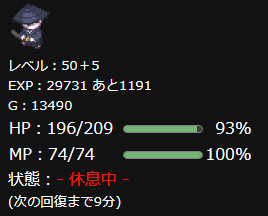

# Status_custom_for_MCQ v2.0
### ミルクチョコクエストの利便性を向上させる拡張機能
必要経験値やHP、MPのゲージ表示、装備の耐久値が少ない時の警告用色変更など、  
ミルクチョコクエストをする上でほんの少しだけ便利になる機能が追加されます。  
また各種設定を設定ファイルに分けた為、誤ってバグらせてしまう可能性も低いです。

## 機能
### 一覧
ステータス画面で、
- 次のレベルに上がる為に必要な経験値を追加。
- 現在の計算式のままレベルアップした場合のレベルを追加。
- HP、MPの隣に％表記とメーターを追加。
- HP、MPの値が50％、20％を切った時に色を変更。
- 装備の隣に耐久値の％表記とメーターを追加。
- 装備の耐久値が50％、20％を切った時に色を変更。
- アイテム数が(最大数 - 1)の時と最大数の時に色を変更。

その他
- ランキング画面に次のレベルに上がる為に必要な経験値を表示。
- 上記の必要経験値とレベルの表示方法をカスタム可能。
- 以上の設定のオン・オフを設定ファイルに分けているため、書き換えやすい。

### 50レベル超のレベル表示、必要経験値、HPとMPの％表記、HPとMPのメーター の追加

現在のHPとMPの隣に、それぞれの％表記とメーターを追加する。
経験値の隣に、次のレベルに上がるのに必要経験値を追加する。
レベルの隣に、同じ計算式でレベルアップした場合のレベルから50を引いた値を追加。

### 必要経験値の表示（ランキング）

ランキングで「レベル」を選択した場合に、現在の経験値の隣に「次のレベルに上がる為に必要な経験値」を表示する。

### 必要経験値と50レベル以上の表示方法のカスタム

必要経験値と50レベル以上の表示方法は、ある程度自由に書き換えられる。
