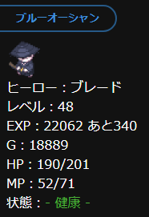
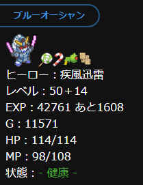

# Status_custom_for_MCQ v2.0
### ミルクチョコクエストの利便性を向上させる拡張機能
必要経験値やHP、MPのゲージ表示、装備の耐久値が少ない時の警告用色変更など、  
ミルクチョコクエストをする上でほんの少しだけ便利になる機能が追加されます。  
また各種設定を設定ファイルに分けた為、設定しやすくなりました。

## 機能
### 一覧
- 設定ファイルで、各種設定の有効・無効の切り替えが可能。
- ステータス画面とランキング画面に次のレベルに上がる為に必要な経験値を表示。  
- 50レベル以上のレベルを表示可能。
- 上記の必要経験値とレベルの表示方法をカスタム可能。
- HP、MPの隣に％表示とメーターを追加。
- 武器と防具の耐久値の隣に％表示とメーターの追加。
- HP、MP、装備のそれぞれに、50％、20％を切った時に色を変えて分かりやすく表示。
- アイテム数がmaxになりそうな時とmaxになった時に色を変えて分かりやすく表示。

### 必要経験値の表示（ステータス）

現在の経験値の隣に「次のレベルに上がる為に必要な経験値」を表示する。
  
### 必要経験値の表示（ランキング）

ランキングで「レベル」を選択した場合に、現在の経験値の隣に「次のレベルに上がる為に必要な経験値」を表示する。
  
### 50レベル以上の表示

現在のレベルの隣に、そのままの計算式でレベルアップした場合のレベルを表示する。

### 必要経験値と50レベル以上の表示方法のカスタム

必要経験値と50レベル以上の表示方法は、ある程度自由に書き換えられる。

### HP、MPの％表示とメーターの表示

現在のHPとMPの隣に、それぞれの％表示とメーターを表示する。
