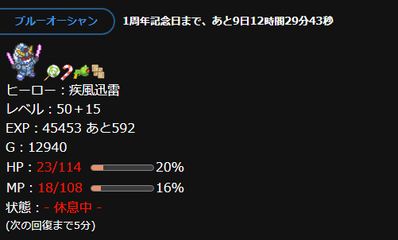
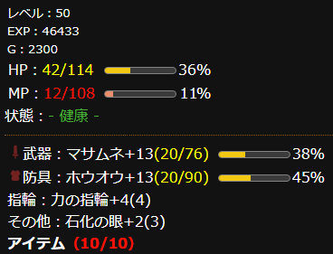
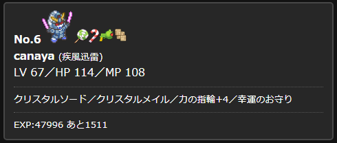
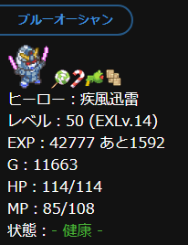
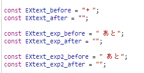
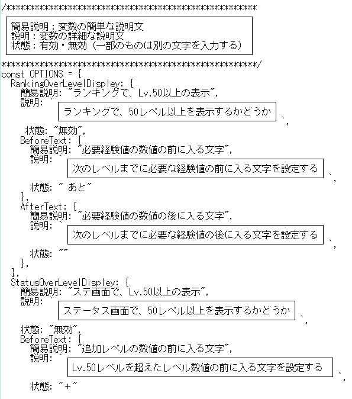
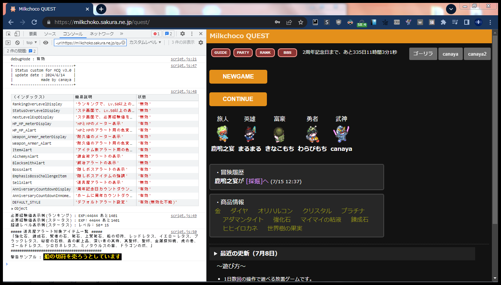

# Status_custom_for_MCQ v3.0
### ミルクチョコクエストの利便性を向上させる拡張機能
必要経験値やHP、MPのゲージ表示、装備の耐久値が少ない時の警告用色変更など、  
ミルクチョコクエストをする上でほんの少しだけ便利になる機能が追加されます。  
また各種設定を設定ファイルに分けており、変更も簡単です。  
**本拡張機能は見た目だけを変更するため、チートではありません。**  

## 機能一覧
ステータス画面で、
- 次のレベルに上がる為に必要な経験値を追加。
- 現在の計算式のままレベルアップした場合のレベルを追加。
- HP、MPの隣に％表記とメーターを追加。
- HP、MPの値が50％、20％を切った時に色を変更。
- 装備の隣に耐久値の％表記とメーターを追加。
- 装備の耐久値が50％、20％を切った時に色を変更。
- アイテム数が(最大数 - 1)の時と最大数の時に色を変更。
- 隠しボスがいる場所に冒険する時対応したアイテムを持っていると、画面右上に「隠しボスに挑みます」と表示。
- タウン名の隣に周年記念日までのカウントダウン（毎秒更新）を追加。

その他
- ランキング画面に次のレベルに上がる為に必要な経験値を表示。
- 上記の必要経験値とレベルの表示方法をカスタム可能。
- ミチクエのホーム画面の「bbs」の隣に、周年記念日までのカウントダウン（毎秒更新）を追加。
- 隠しボスのいる場所に冒険中、アイテム欄に対応するアイテムがある場合、そのアイテムを太文字に変更。
- 現在の設定を確認可能なデバッグモード。

試験中の機能（内容に誤りがある可能性がある為、デフォルトで無効。自己責任で有効にして下さい。）
- 鍛冶・錬金術を行う際にどのアイテムが使用されるか、予想を画面右上に表示。
- 鍛冶を行う際にどのアイテムが使用されるか、予想を画面右上に表示。
- 道具屋で設定ファイルに書いたアイテムを売却しようとした際に、画面右上に警告を表示。
- 上記の通知表示の文字色・背景色・太文字をカスタム可能。

以上の設定のオン・オフを設定ファイルで書き換えて設定可能。  

## 機能の詳細解説
### 50超レベル、必要経験値、HP・MP・耐久値の％表記・メーター・色変更、カウントダウン の追加

現在のHP・MP・耐久値の隣に、それぞれの％表記とメーターを追加する 
現在のHP・MP・耐久値が50％、20％を切った時に色を変更する。 
経験値の隣に、次のレベルに上がるのに必要経験値を追加する。 
レベルの隣に、同じ計算式でレベルアップした場合のレベルから50を引いた値を追加。 
タウン名の隣に、周年記念日までのカウントダウン（毎秒更新）を追加。 
カウントダウンは、0になると自動で次の周年記念日までのカウントダウンに更新されます。 

### 必要経験値の表示（ランキング）

ランキングで「レベル」を選択した場合に、現在の経験値の隣に「次のレベルに上がる為に必要な経験値」を表示する。

### 必要経験値と50レベル以上の表示方法のカスタム

必要経験値と50レベル以上の表示方法は、ある程度自由に書き換えられる。

### ミチクエのホーム画面の「bbs」の隣に、カウントダウンの追加

bbsボタンの隣に、周年記念日までのカウントダウン（毎秒更新）を追加。 
カウントダウンは、0になると自動で次の周年記念日までのカウントダウンに更新されます。 

### 冒険する時、隠しボス対応アイテムを持っていると画面右上に通知される

6/14時点で実装されている3種の隠しボスとストーリー上の1種に対応。 
隠しボスがいる場所に挑戦する時、必要なアイテムを持っていると、画像のように表示して教えてくれます。 

### 設定ファイルでオン・オフを変更できる

「有効」と書くとオンに、「有効」以外が書かれている場合はオフになります。

### デバッグモードで現在の設定を確認可能

Ctrl+Shift+Iの同時押しで表示されるデベロッパーツールを使用して、現在の設定を確認できる。 
表示されたデベロッパーツール上部の「コンソール」をクリックすると、画像のように現在の設定が表示される。
