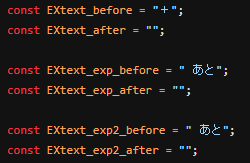

# Status-custom-for-MCQ
### ミルクチョコクエストの利便性を向上させる拡張機能
前身の「EXP custom for MCQ」から必要経験値表示などを受け継ぎつつ、新機能を追加！  
今後の更新のための整備も実施！

## 機能一覧
- ステータス画面とランキング画面に次のレベルに上がるまでに必要な経験値を表示。  
- 50レベル以上のレベルを表示可能。
- 上記の必要経験値とレベルの表示方法をカスタム可能。
- HP、MPの隣に％表示とメーターを追加。

### 必要経験値の表示（ステータス）

現在の経験値の隣に「次のレベルに上がる為に必要な経験値」を表示する。

### 必要経験値の表示（ランキング）

ランキングで「レベル」を選択した場合に、現在の経験値の隣に「次のレベルに上がる為に必要な経験値」を表示する。

### 50レベル以上の表示

現在のレベルの隣に、そのままの計算式でレベルアップした場合のレベルを表示する。

### 必要経験値と50レベル以上の表示方法のカスタム

必要経験値と50レベル以上の表示方法は、ある程度自由に書き換えられる。
